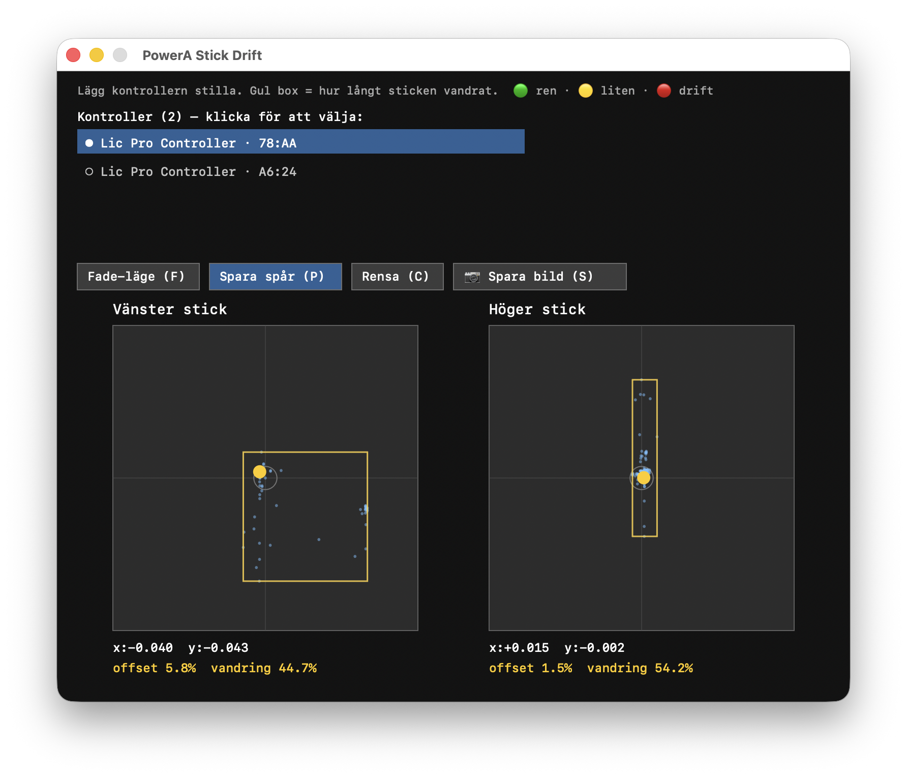

# macOS Stick Drift Tester

A tiny, dependency-free macOS tool for testing analog **stick drift** on game
controllers — reading raw HID input directly from IOKit, so it works even with
controllers that higher-level APIs refuse to recognize.

Comes in two flavors:

- **`drift_gui`** — a native AppKit window that visualizes both sticks in real
  time, with a wander trail, bounding box, multi-controller selection, and PNG
  screenshot export for evidence.
- **`drift`** — a headless CLI that prints numeric drift statistics (mean
  offset, jitter, std-dev) per axis.



> Tip: launch the GUI, switch to **Persist** mode (`P`), let the controller sit
> untouched, then press `S` to save a screenshot — a drifting stick paints a
> smear far from center while a healthy one stays a tight dot.

## Why this exists

Many "officially licensed" Switch Pro-compatible controllers (for example the
**PowerA Enhanced Wireless Controller**) report a **Vendor/Product ID of `0`**
over Bluetooth. Because of that, higher-level gamepad APIs often fail to expose
them at all:

- The **browser Gamepad API** (Chrome/Safari) may never list the controller.
- Apple's **GameController framework** (`GCController`) can miss it too, since
  it keys off recognized vendor/product IDs.

macOS itself still enumerates the device as a perfectly ordinary HID Game Pad
(`Generic Desktop` / `Game Pad`) and streams its input reports. This tool reads
at that lowest layer — **IOKit `IOHIDManager`** — where the VID/PID don't
matter. If macOS can see the controller at all, this tool can read its sticks.

That makes it a reliable way to capture proof of stick drift for a warranty
claim, even when the usual online gamepad testers come up empty.

## Requirements

- macOS (uses AppKit + IOKit)
- Swift toolchain (Xcode Command Line Tools: `xcode-select --install`)

No third-party dependencies, no package manager, no app bundle.

## Build & run

```sh
make            # builds ./drift_gui and ./drift
make run        # builds and launches the GUI
```

Or compile a single tool directly:

```sh
swiftc -O drift_gui.swift -o drift_gui && ./drift_gui
swiftc -O drift.swift -o drift && ./drift rest 5
```

## Using the GUI

1. Launch `drift_gui`. If the controller list says *"Ingen ansluten"*, press any
   button on the controller once so macOS starts streaming input.
2. Pick a controller from the list at the top (click a row). Multiple
   controllers are auto-detected on connect/disconnect and disambiguated by the
   last digits of their Bluetooth MAC address.
3. Put the controller down, hands off, and watch the sticks.

Controls (buttons or keyboard):

| Key | Action |
|-----|--------|
| `F` | **Fade** — trail fades out over ~2.5 s (live view) |
| `P` | **Persist** — keep every point, building up the full wander pattern |
| `C` | **Clear** the current trail |
| `S` | **Screenshot** — save a PNG of the window to your Desktop |

Screenshots are written to `~/Desktop/stickdrift-<controller>-<timestamp>.png`
(falling back to your home folder if there's no Desktop).

## Using the CLI

```sh
./drift probe       # confirm the controller is readable, list detected axes
./drift rest 5      # sample 5 s at rest and print per-axis drift stats
```

## Reading the results

Stick values are normalized to **−1..+1** with the resting center at **0**.

- **offset** — how far the resting position sits from dead center. A healthy
  stick rests within its deadzone (a few percent). A steady, large offset is
  classic drift.
- **wander / jitter** — how much the value moves around while untouched. The
  yellow bounding box shows the spread visually.
- **verdict color** — 🟢 clean · 🟡 small offset (usually within deadzone) ·
  🔴 drift.

A useful tell: a genuinely *drifting* stick shows a **steady offset with small
jitter**, while large erratic swings while "at rest" usually mean the stick was
touched — or that the sensor is failing in a worse way than simple drift.
Compare a suspect stick against the other stick on the same controller as a
known-good reference.

## Axis mapping

Detected axes (Generic Desktop usages): left stick = `X`/`Y` (`0x30`/`0x31`),
right stick = `Rx`/`Ry` (`0x33`/`0x34`). Mapping can vary between controllers;
the tool labels whatever axes the device reports.

## Limitations

- macOS only.
- Tested against a PowerA Enhanced Wireless Controller (Switch Pro protocol over
  Bluetooth). Other HID gamepads should work but axis labels may differ.
- Reads input only; it does not write rumble, calibration, or other reports.

## License

[MIT](LICENSE) — do anything you like; just keep the copyright notice.
